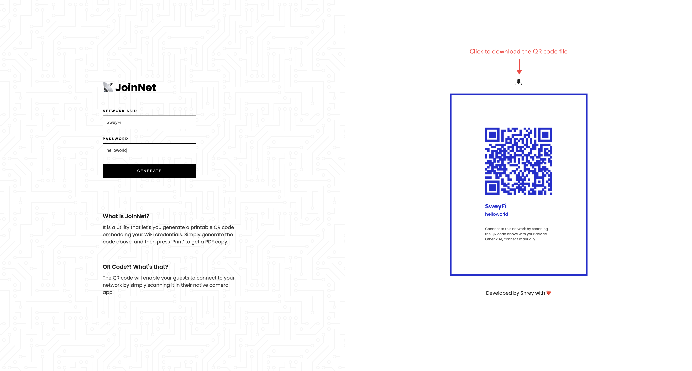
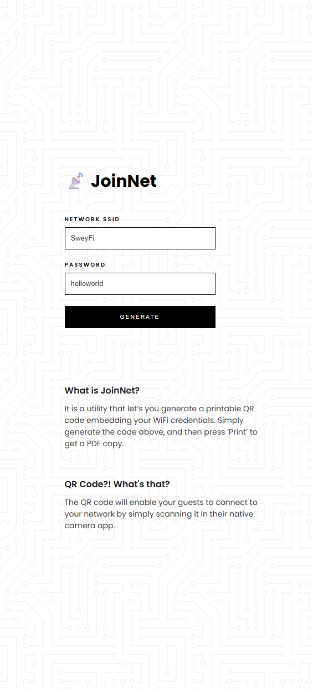

# JoinNet

## About

Having friends or guests come over to your house is always exciting, until they all ask for your WiFi password. Most people do not really change their default modem password which can be something really random and hard to remember - so it is a hassle connecting everyone.

This problem gave me the motivation to create a tool which generates a QR code for your WiFi credentials, so you only have to go through the process once and then it always stays with you. If some devices cannot scan QR codes, they can also join manually as the generated card also contains the credentials.

## How to run it

1. Using Git, clone the repository in the working directory of your computer.

```
git clone https://github.com/shreytailor/joinnet/
```

2. Run the app by opening `index.html` file in your browser

## Screenshots

> Desktop



> Mobile


